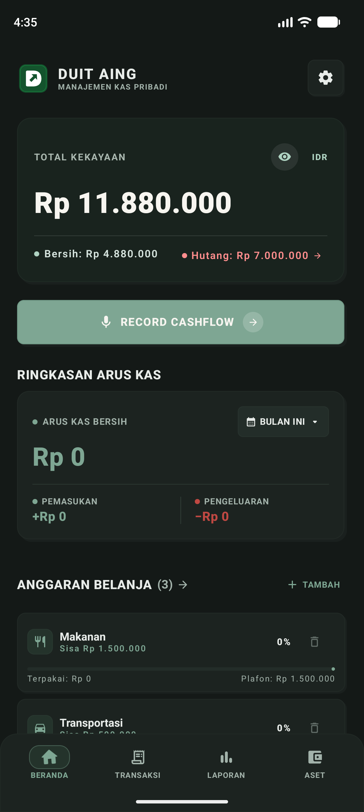
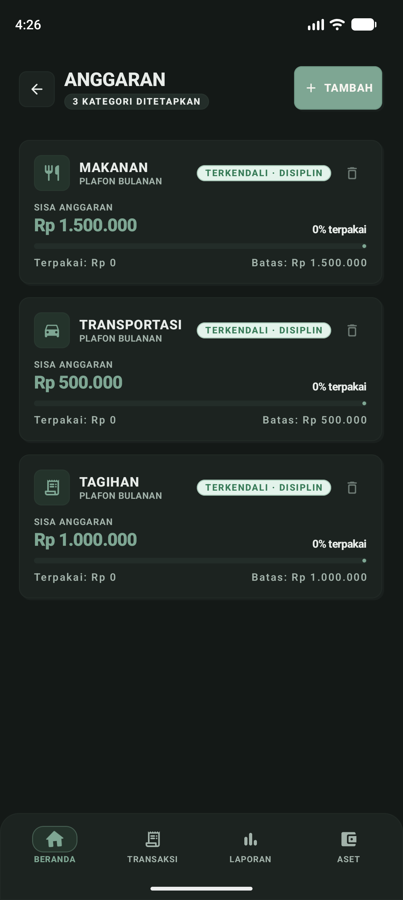
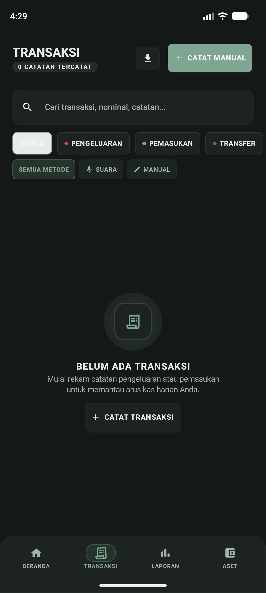
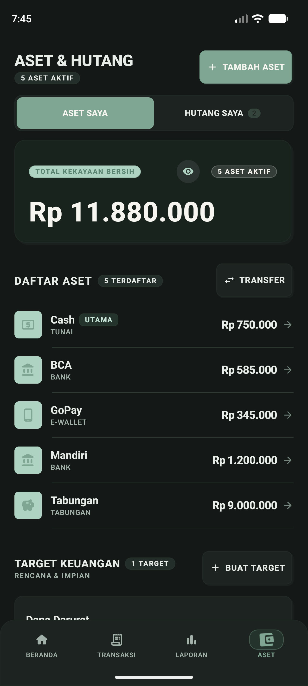
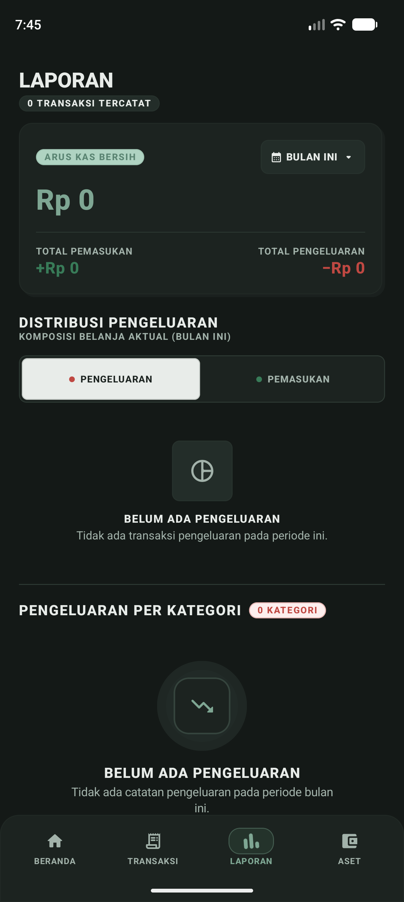

# 💸 Duit Aing — Manajemen Kas & Kekayaan Pribadi

<div align="center">



### *"Kelola uang tanpa pusing, catat transaksi secepat berucap."*

**Aplikasi pencatat keuangan pribadi yang tenang, taktil, dan 100% privat (Offline-First).**  
Didesain khusus untuk ritme hidup sehari-hari di Indonesia dengan arsitektur modern **Android Jetpack Compose**, **Material 3**, serta bahasa visual **"Jade Pebble Morning"** yang elegan dan tidak melelahkan mata.

[-3DDC84.svg?style=flat-square&logo=android)](https://developer.android.com)
[](https://kotlinlang.org)
[](https://developer.android.com/jetpack/compose)
[](https://developer.android.com/training/data-storage/room)
[](PRIVACY.md)
[](LICENSE)

</div>

---

## 🌿 Cerita di Balik "Duit Aing"

Mengelola uang sering kali menjadi rutinitas yang melelahkan: membuka aplikasi finansial yang penuh iklan promo, menunggu loading lambat, mengetik nominal angka nol yang terlalu banyak tanpa tanda baca, atau cemas data privasi rekening bocor ke pihak luar.

**Duit Aing** lahir dari satu keinginan sederhana:  
> *Membuat pencatatan uang terasa manusiawi, sekejap selesai, dan memberi rasa tenang saat melihat kondisi finansial kita.*

Tidak ada formulir bertingkat yang membingungkan. Tidak ada sinkronisasi cloud yang menguras kuota atau mengintip saldo Anda. Semuanya tersimpan aman di saku Anda sendiri.

---

## ✨ Fitur-Fitur Andalan

### 🎙️ 1. Sat-Set Voice-to-Transaction (Bahasa Indonesia)
Cukup ucapkan pengeluaran Anda layaknya berbicara dengan teman:
> *"Beli bensin pertalite 35 ribu pakai Cash"*  
> *"Nasi padang 25 ribu bayar pakai QRIS BCA"*  
> *"Dapat transferan gaji 7 juta ke rekening Mandiri"*

Sistem pemrosesan bahasa alami (NLP) yang tertanam di perangkat akan langsung membedah tipe transaksi, nominal uang, kategori belanja, hingga aset pembayarannya secara otomatis tanpa perlu koneksi internet.

### 🧮 2. Input Rupiah Cerdas & Alami (Titik Otomatis)
Tidak perlu lagi menghitung manual apakah nolnya kurang atau kelebihan saat mengetik nominal:
- Saat Anda mengetik `50000`, layar langsung memformat menjadi `50.000` dengan pembaca teks konfirmasi: *"Terbaca: Rp 50.000"*.
- Dilengkapi tombol cepat nominal (`+10rb`, `+50rb`, `+100rb`, `+1jt`) untuk pengisian secepat kilat.

### 🛡️ 3. Privasi Nyaman & Keamanan Sesi Biometrik
- **Sensor Saldo Satu Ketukan (Eye-Toggle)**: Sembunyikan seluruh nominal uang menjadi `••••••` saat Anda membuka aplikasi di transportasi umum atau tempat ramai.
- **Kunci Sidik Jari (Biometric Lock)**: Proteksi akses dengan sensor biometrik perangkat. Dilengkapi pengaturan **Timeout Sesi** (Langsung, 30 detik, 1 menit, 5 menit) agar Anda tidak perlu membuka kunci berulang kali saat bolak-balik memeriksa struk.

### 📊 4. Dasbor Ringkas & Bernapas
- **Arus Kas Hidup (Living Pulse)**: Indikator visual real-time yang memperlihatkan apakah arus kas bulan ini surplus atau defisit.
- **Preview Anggaran Bersahaja**: Di Beranda hanya ditampilkan pratinjau kategori belanja utama agar antarmuka tidak sesak, dengan navigasi geser mulus (*slide transition*) ke Halaman Anggaran penuh.
- **Grafik Komposisi & Tren**: Diagram donat dan tren arus kas dengan palet warna lembut yang informatif.

### ↩️ 5. Jaring Pengaman "Undo" Transaksi
Tidak sengaja menghapus transaksi penting? Jangan panik. Duit Aing menyediakan tombol aksi **`BATALKAN`** pada notifikasi snackbar bawah untuk mengembalikan data dan mengoreksi saldo Anda seketika.

### 💼 6. Manajemen Rekening, Hutang & Target Finansial
- **Multi-Aset**: Kelola uang tunai (Cash), tabungan bank, dompet digital, hingga pos investasi.
- **Buku Catatan Hutang/Piutang**: Pantau pinjaman uang yang harus dibayar maupun dana yang dipinjam teman secara terorganisir.
- **Target Keuangan (Goals)**: Tetapkan impian (misal: *Dana Darurat*, *DP Rumah*, *Qurban*) lengkap dengan alokasi tabungan berkala.

### 📄 7. Ekspor Laporan Bersih (PDF & CSV)
Butuh mencetak rekapitulasi bulanan atau menganalisisnya di Excel/Google Sheets? Ekspor riwayat pembukuan Anda kapan saja dalam format PDF siap cetak atau tabel CSV rapi.

---

## 📱 Galeri Tampilan Aplikasi

<div align="center">

| 1. Beranda Finansial | 2. Anggaran Kategori | 3. Riwayat & Filter |
|:---:|:---:|:---:|
|  |  |  |

<br />

| 4. Manajemen Multi-Aset | 5. Laporan & Distribusi |
|:---:|:---:|
|  |  |

</div>

---

## 🎨 Filosofi Desain: *Jade Pebble Morning*

Duit Aing menghindari tren antarmuka fintech yang serba dingin atau neon silau. Kami menerapkan gaya desain berkarakter:
- **Taktil & Berbobot**: Menggunakan konsep *Double-Bezel Card Architecture* dengan kedalaman bayangan solid halus, memberikan sensasi fisik seperti menyentuh buku catatan berkualitas.
- **Palet Warna Alami**: Kombinasi hijau giok lembut (*Jade Primary*), warna batu alam pekat (*Dark Surface*), dan aksen hangat yang ramah bagi mata, baik di siang hari maupun malam hari (*Dark Mode*).
- **Aksesibilitas Nyaman**: Seluruh tombol interaktif telah dioptimalkan dengan target sentuh standar 44–48dp dan label pembaca layar (*TalkBack*).

---

## 🏗️ Arsitektur & Tumpukan Teknologi

Aplikasi ini dibangun mengedepankan prinsip **Ponytail (Minimal, Efisien, Tanpa Bloatware)** dan **Clean Architecture**:

| Komponen | Teknologi |
|---|---|
| **Bahasa Utama** | [Kotlin 2.0+](https://kotlinlang.org) dengan Kotlin Coroutines & Flow |
| **User Interface** | [Jetpack Compose](https://developer.android.com/jetpack/compose) + Material 3 Design Tokens |
| **Arsitektur UI** | Unidirectional Data Flow (UDF) + MVVM (`StateFlow` & `SharedFlow`) |
| **Basis Data Lokal** | [Room Database](https://developer.android.com/training/data-storage/room) (SQLite Engine dengan enkripsi lokal) |
| **Keamanan** | AndroidX BiometricPrompt API + SharedPreferences aman |
| **Audio & NLP** | Android SpeechRecognizer terintegrasi dengan pemroses aturan regex lokal bahasa Indonesia |
| **Animasi** | Jetpack Compose Animations (`AnimatedContent`, `animateFloatAsState`, `animateColorAsState`) |

---

## 🚀 Memulai & Menjalankan Proyek

### Prasyarat
- **Android Studio** Ladybug (2024.2+) atau versi lebih baru
- **JDK 17** atau **JDK 21**
- **Android SDK** API 35 (Android 15) dengan build-tools terbaru

### Langkah Menjalankan
1. **Clone repositori**:
   ```bash
   git clone https://github.com/agungrmdniiii/cashflow-android.git
   cd cashflow-android
   ```
2. **Buka di Android Studio**:  
   Pilih `File` > `Open...` dan arahkan ke direktori proyek. Tunggu proses *Gradle Sync* selesai.
3. **Jalankan Unit Test**:
   ```bash
   ./gradlew testDebugUnitTest
   ```
4. **Deploy ke Emulator / HP Fisik**:
   ```bash
   ./gradlew installDebug
   ```

---

## 🔒 Jaminan Privasi 100%

- 🚫 **Tanpa Iklan**: Bebas dari banner atau pop-up yang mengganggu.
- 🚫 **Tanpa Registrasi / Akun Cloud**: Anda tidak perlu mendaftarkan email atau nomor ponsel.
- 🚫 **Tanpa Pelacak (Zero Analytics)**: Tidak ada SDK analitik pihak ketiga yang mengumpulkan perilaku Anda.
- 💾 **Data Milik Anda Sepenuhnya**: Seluruh transaksi tersimpan di memori perangkat Anda. Anda bebas mencadangkan atau menghapus database kapan saja.

---

## 🤝 Kontribusi

Saran, perbaikan bug, dan ide fitur baru selalu disambut dengan hangat!
1. Lakukan *Fork* repositori ini.
2. Buat branch fitur Anda (`git checkout -b fitur/fitur-keren-anda`).
3. Commit perubahan Anda (`git commit -m "feat: Menambahkan fitur keren"`).
4. Push ke branch Anda (`git push origin fitur/fitur-keren-anda`).
5. Buka *Pull Request*.

---

## 📄 Lisensi

Proyek ini dilisensikan di bawah [Apache License 2.0](LICENSE).  
Dibuat dengan dedikasi untuk pencatatan keuangan pribadi yang lebih jujur, tenang, dan mandiri.
